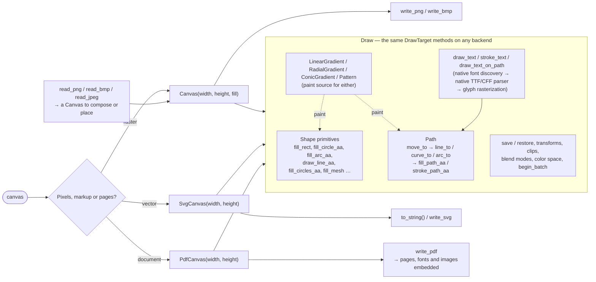

[](https://randyzwitch.com/canvas_mojo/)

A 2D drawing engine in pure Mojo: pixel buffers, shape and path
primitives, gradients, compositing, real system-font text,
PNG/BMP/SVG/PDF output and PNG/BMP/JPEG input. No Cairo, no FreeType,
no libpng or libjpeg anywhere in the pipeline.

## Why canvas_mojo

**One language, top to bottom.** Drawing shapes and text to an image
is usually a job handed to a C library from whatever language you are
working in. Here the whole rasterizer is Mojo: readable, debuggable
and modifiable in the same language as the code calling it.

**One drawing interface, three outputs.** `Canvas` (raster),
`SvgCanvas` (SVG markup) and `PdfCanvas` (PDF pages with embedded font
subsets) implement the same `DrawTarget` trait. Code written against
the trait, such as a chart library's rendering core, draws to any of
them without knowing which it holds.

**Text from the fonts on the machine.** Font discovery, TrueType and
OpenType parsing, color bitmap emoji, bidirectional layout and glyph
rasterization are all native. Text is measured, aligned, rotated, laid
out in blocks and placed on paths, and a PDF carries the used glyphs
as an embedded subset with a ToUnicode map.

**Output you can pin.** Every rasterizer writes each pixel exactly
once, so translucent fills never double-blend, and rendering is
deterministic to the byte. The test suite holds golden images and
byte-identity comparisons across every rendering path, so a picture
that is right stays right.

**Built for charts, measured as it goes.** Bulk markers, meshes for
surface plots, a batch API that renders a whole scene across cores,
and a supersampled region that anti-aliases at three or four times
the resolution without ever holding the enlarged buffer. Every
parallel threshold in the package was measured rather than assumed,
and a benchmark survey with a recorded reference gates each release.

## Quickstart

**See it work in under a minute.** Clone this repo and run the
examples:

```sh
pixi run example   # renders examples/*.mojo to examples/out_*.{bmp,png,svg,pdf}
```

Open any `examples/out_*.png` to see the picture next to the code that
drew it. [Examples](https://randyzwitch.com/canvas_mojo/examples/)
walks through every one, source alongside its rendered output.

**Use it in your own project.** Add it as a git dependency. The
snippet below extends an existing Pixi project; for a complete
configuration starting from an empty directory, follow
[Getting Started](https://randyzwitch.com/canvas_mojo/getting-started/).

```toml
[workspace]
preview = ["pixi-build"]  # git-source pixi dependencies are a preview feature

[dependencies]
canvas_mojo = { git = "https://github.com/randyzwitch/canvas_mojo.git", tag = "v0.41.0" }
```

Use `branch = "main"` instead of `tag` to track development.
`pixi install` builds `canvas_mojo` from that git ref and installs the
resulting package into your workspace's environment, where Mojo's own
toolchain finds it with no `-I` flag. Then:

```mojo
from canvas import Canvas, Color, fill_circle_aa, write_png

def main() raises:
    var c = Canvas(200, 200, Color(255, 255, 255))
    fill_circle_aa(c, 100, 100, 80, Color(40, 100, 200))
    write_png(c, "out.png")
```

## How it fits together



The wiki's
[Architecture](https://github.com/randyzwitch/canvas_mojo/wiki/Architecture)
page walks through each path and the rendering model behind it.

## What is included

- **Shapes:** lines, polylines, rectangles, circles, ellipses, arcs,
  wedges, ring sectors and polygons, each in a hard-edged and an
  anti-aliased form, with dashes, caps, joins and miter limits on
  strokes.
- **Paths:** multi-subpath `Path` values with lines, quadratic and
  cubic curves and arcs; fill under either fill rule, stroke, hit-test,
  transform and measure.
- **Paint:** linear, radial and conic gradients, raster and hatch
  patterns, interpolated in sRGB or linear light.
- **Bulk and mesh:** `fill_circles_aa`, `fill_ellipses_aa` and
  `fill_arcs_aa` for thousands of markers in one call; `fill_mesh` for
  adjacent faces drawn seam-free as one shape; `fill_mesh_shaded` for a
  color per vertex interpolated across each face.
- **State:** affine transforms, `save`/`restore`, rectangle and path
  clips, Porter-Duff and separable and non-separable blend modes.
- **Compositing and effects:** canvas-to-canvas placement with
  transforms and filters, 8-bit masks, Gaussian blur, drop shadows,
  downsampling and resizing.
- **Text:** installed TrueType and OpenType fonts found by family,
  slant and weight; color bitmap emoji; alignment; multi-line blocks;
  measurement before drawing; prepared layouts; text on a path;
  bidirectional runs.
- **Image I/O:** PNG read and write, BMP read and write, baseline and
  progressive JPEG read.
- **Rendering:** a batch that records a scene and renders it across
  cores, and a supersampled region that anti-aliases at a multiple of
  the output resolution without materializing the enlarged buffer.
- **Backends:** raster `Canvas`, `SvgCanvas`, and multipage `PdfCanvas`.

## Limitations

- Text needs fonts installed on the machine, as any text stack does.
  The package finds them itself; it does not ship any.
- There is no window, display or input layer. The package draws into
  buffers and files.
- Rendering is CPU only. It parallelizes across cores; it does not use
  a GPU.
- The vector backends record geometry and leave rasterization to the
  viewer. Linear-light blending is guaranteed only on `Canvas`; SVG
  text depends on the viewer's fonts; `PdfCanvas` does not draw color
  emoji. `SvgCanvas` draws a smooth-shaded mesh flat, one color per
  face, since browsers have no mesh gradient.
- Meshes are drawn in the order given. A depth-sorted surface renders
  correctly; intersecting surfaces have no correct painter's order,
  which is the same limit every static plotting library accepts.

## Learn more

- **[Docs and examples](https://randyzwitch.com/canvas_mojo/)**: every
  example's source next to its rendered output, guides to the
  conventions, and the full `canvas` API reference generated from the
  docstrings.
- **[llms.txt](https://randyzwitch.com/canvas_mojo/llms.txt)**: the
  whole public API on one page with recipes, for a model or a person
  building against the library. `skills/canvas-mojo/` is the matching
  agent skill and `AGENTS.md` is the guide for working on the code.
- **[Wiki](https://github.com/randyzwitch/canvas_mojo/wiki)**: the
  [Architecture](https://github.com/randyzwitch/canvas_mojo/wiki/Architecture),
  the [Changelog](https://github.com/randyzwitch/canvas_mojo/wiki/Changelog)
  of what was built and why, the
  [Backlog](https://github.com/randyzwitch/canvas_mojo/wiki/Backlog) of
  what was deliberately not, and a
  [Coverage](https://github.com/randyzwitch/canvas_mojo/wiki/Coverage)
  check of the primitive set against a 41,000-visualization corpus.
- **[Releases](https://github.com/randyzwitch/canvas_mojo/releases)**:
  every tag has release notes with the measured numbers behind it.

## Status

Version 0.41.0, on Linux x86-64, Linux aarch64, and macOS Apple
Silicon, with Mojo 1.1 or newer. CI runs the full suite on all three
platforms for every pull request. Before tagging, a release runs the
benchmark survey against its recorded reference and verifies every
scene digest.

canvas_mojo is the drawing layer. Axes, scales, legends and series
types belong to a charting library built on top of it, and one is.
Contributions are welcome; [CONTRIBUTING.md](CONTRIBUTING.md) covers
the layout, the conventions, and how to add a primitive, an example or
a test.

## Development

```sh
pixi run test      # tests/*.mojo, in parallel
pixi run example   # examples/*.mojo, writes examples/out_*.{bmp,png,svg,pdf}
pixi run bench     # the benchmark survey, one row per primitive
pixi run docs      # regenerates the site into docs/site/public; run `example` first
```

The site rebuilds and deploys automatically on every push to `main`
that touches `canvas/`, `examples/` or `docs/`, and a pull request runs
the same build as a status check without deploying.

## License

MIT. See [LICENSE](LICENSE).
