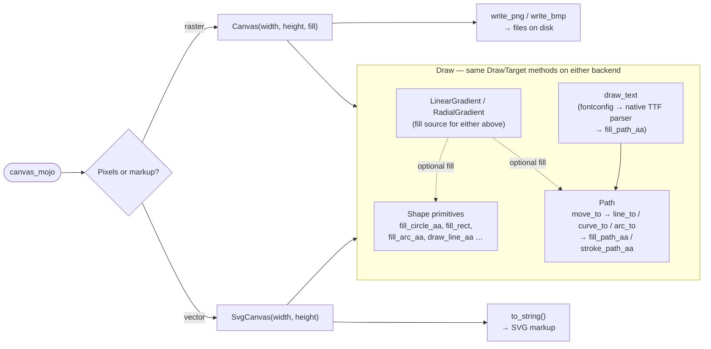

# canvas_mojo

[](https://randyzwitch.com/canvas_mojo/)

A 2D drawing engine written entirely in Mojo: pixel buffers, shape and
path primitives, gradients, real system-font text, and PNG/BMP/SVG
output — no Cairo, no FreeType, no other C rendering library anywhere
in the pipeline.

## Why canvas_mojo?

Drawing shapes and text to an image is usually a job you hand to a C
library — Cairo, Skia, FreeType — from whatever language you're
actually working in. canvas_mojo asks what that same job looks like
kept entirely in Mojo instead: one language, top to bottom, so the
whole rasterizer is readable and hackable rather than a thin wrapper
around someone else's binary. `Canvas` (raster) and `SvgCanvas`
(vector) both implement the same `DrawTarget` trait, so code written
against that trait — a chart library's own rendering core, say — works
against either backend without knowing which one it's drawing into.

This is an early-stage, heavily Claude-influenced personal project, so
don't expect polish or a clean mapping onto Cairo's concepts. If you
know what you're doing and want to contribute, let's chat.

## Quickstart

**See it work in under a minute** — clone this repo and run the
examples:

```sh
pixi run example   # renders examples/*.mojo to examples/out_*.{bmp,png}
```

Open any `examples/out_*.png` to see the picture next to the code that
drew it. [Examples](https://randyzwitch.com/canvas_mojo/examples/)
walks through every one, source alongside its actual output.

**Use it in your own project** — add it as a git dependency:

```toml
[workspace]
preview = ["pixi-build"]  # git-source pixi dependencies are still a preview feature

[dependencies]
canvas_mojo = { git = "https://github.com/randyzwitch/canvas_mojo.git", branch = "main" }
```

`pixi install`/`pixi run` builds `canvas_mojo` from that git ref and
installs the resulting precompiled package into your workspace's pixi
environment — Mojo's own toolchain finds it there automatically, no
`-I` flag needed. Then:

```mojo
from canvas_mojo import Canvas, Color, fill_circle_aa
from canvas_mojo.io.bmp import write_bmp

def main() raises:
    var c = Canvas(200, 200, Color(255, 255, 255))
    fill_circle_aa(c, 100, 100, 80, Color(40, 100, 200))
    write_bmp(c, "out.bmp")
```

## How it fits together



See the wiki's
[Architecture](https://github.com/randyzwitch/canvas_mojo/wiki/Architecture)
page for a walkthrough of each path with runnable examples.

## Learn more

- **[Docs & examples](https://randyzwitch.com/canvas_mojo/)** — every
  example's source next to its actual rendered output, plus the full
  `canvas_mojo` API reference, generated from this repo's own
  docstrings via [modo](https://github.com/mlange-42/modo) (see
  `docs/modo.yaml`/`pixi run docs`).
- **[Wiki](https://github.com/randyzwitch/canvas_mojo/wiki)** — what's
  built
  ([Changelog](https://github.com/randyzwitch/canvas_mojo/wiki/Changelog))
  vs. still open
  ([Backlog](https://github.com/randyzwitch/canvas_mojo/wiki/Backlog)).

## Status

Mojo-only, plus one small direct FFI dependency on a system library
`canvas_mojo/text/render.mojo` links against for real system-font text
rendering: `libfontconfig` (font matching — resolving a family/style
name to an actual installed font file —
`canvas_mojo/text/font_discovery.mojo`), a typical,
near-universally-installed system library, not a new requirement this
package introduces.

Font *parsing* (glyph outlines, metrics, `canvas_mojo/text/ttf.mojo`)
and rasterization (this package's own `fill_path_aa`) are both native
Mojo — no FreeType, no Cairo, no other third-party rendering/font
engine anywhere in the pipeline.

## Development

```sh
pixi run test      # tests/*.mojo
pixi run example   # examples/*.mojo, writes examples/out_*.{bmp,png}
pixi run docs      # regenerates docs/ (served via GitHub Pages) -- run `example` first
```

`docs/` also rebuilds and deploys automatically
(`.github/workflows/docs-deploy.yml`) on every push to `main` that
touches `canvas_mojo/`, `examples/`, or `docs/` -- manual `pixi run
docs`/`pixi run docs-serve` are for previewing locally before you
push, not required to keep the site in sync. A pull request runs the
same build (`.github/workflows/docs.yml`) as a status check, without
deploying.

See [CONTRIBUTING.md](CONTRIBUTING.md) for the full guide: project
layout, coding conventions, and how to add a new primitive, example,
or test.

## License

MIT — see [LICENSE](LICENSE).
